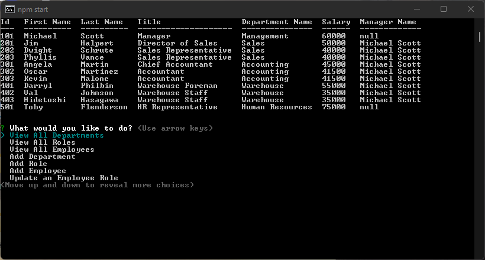

# Employee Tracker

## Purpose
An app to easily interface with your company database to view, make changes, and update

## Description
This project uses mysql2 to store and manage data, as well as inqurier to faciliate interatction and console.table to create clean tables. 

## Installation

Node and the Inquirer.js package are required to run this tool, as well as mysql2. 
 
Clone the repository and run <code> npm start </code> on a terminal from the root. Watch the video walkthrough for additional instruction.
 

[Video Walkthrough](https://youtu.be/5HYnxUoz3fg)  

## Usage

 Follow the prompts to view departments, roles, or employees. Alternatively the tool can make changes or additions to the database. Use this tool to make managing intimate teams more efficent

  

## Questions 

Please direct questions to my github at [esimondet](https://github.com/esimondet)
or email [edison.simondet@gmail.com](edison.simondet@gmail.com).

###### Made using [Readme Generator](https://github.com/esimondet/readme-generator)!